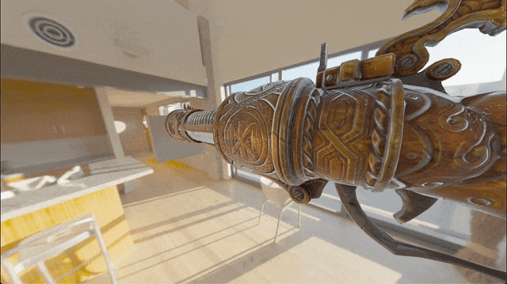

# Rust Physically Based Renderer

A physically based renderer written in Rust using wgpu-rs.

Implements precomputed BRDF, specular, and diffuse image-based lighting methods.

Supports gLTF and GLB model imports.





## Getting Started

### Setup

To download all dependencies and run the example program, run:

```
cargo build --release
cargo run --release
```

### Usage

Setup code for an example render loop can be found in `main.rs`.

Models can be imported from files as a byte stream:

```
graphics::Renderable::new_from_glb(
    ...,
    include_bytes!("../res/DamagedHelmet.glb"),
    ...,
);
```

or from a path:

```
graphics::Renderable::new_from_path(
    ...,
    std::path::Path::new("/path/to/model.gltf"),
    ...,
);
```
